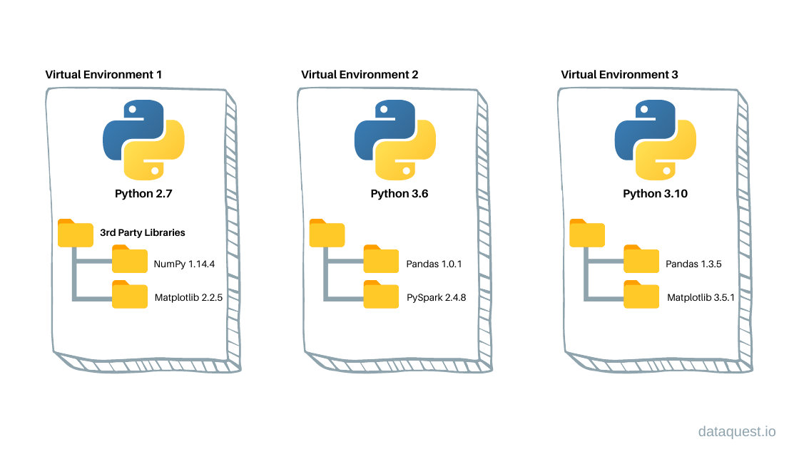

# Les environnements virtuels en Python

## Qu'est-ce qu'un environnement virtuel ?

Un **environnement virtuel** est un espace isolé qui permet de gérer des dépendances de projets spécifiques sans interférer
avec d'autres projets ou avec l'environnement Python global de votre système. 

## Pourquoi utiliser un environnement virtuel ?
- **Isolation** : Éviter les conflits de versions entre les packages utilisées dans différents projets.
- **Facilité de gestion** : Travailler avec des dépendances spécifiques pour chaque projet.
- **Portabilité** : Permettre aux autres développeurs de répliquer facilement l'environnement de votre projet et ayant
exactement les mêmes package et version d'installés.



En résumé, un environnement virtuel vous permet de :
1. Utiliser différentes versions de pacakge dans différents projets.
2. Garder l'environnement global propre en installant les dépendances uniquement dans le projet en cours.

# Utilisation de `pipenv` pour gérer les environnements virtuels

`pipenv` est un outil pratique pour gérer les environnements virtuels et les dépendances des projets Python.
Il combine les fonctionnalités de `pip` et de `virtualenv` dans un seul outil facile à utiliser.

Pipenv est développé par @kennethreitz, un pilier dans la communauté de Python, vous pouvez accéder à la documentation
de pipenv ici https://pipenv.pypa.io/en/latest/

## Installation de `pipenv`
Pour installer `pipenv`, exécutez la commande suivante :

```bash
pip install pipenv
```

## Installation des dépendances

A la racine du projet, ous pouvez voir qu'il y a deux fichiers disponibles :
- Pipfile
- Pipfile.lock

Ces fichiers définissent les dépendances de notre projet et donc les packages que nous devons installer afin que celui tourne
sans soucis

Si vous ouvrez le fichier `PipFile` vous pouvez voir toutes ces dépendances ainsi que les versions requises.

Pour créer un environnement virtuel et installer les dépendances avec Pipenv lancez la commande suivante à la racine du projet :

```bash
pipenv install
```

Grâce à cette commande et aux environnements virtuels, chaque élève qui suit ce cours a les packages nécessaires avec les
bonnes versions !

## Activation et désactivation de l’environnement virtuel

Vous devez activer l'environnement virtuel dans votre terminal afin d'utiliser l'éxecutable python de celui ci depuis 
votre terminal

```bash
pipenv shell
```

Selon votre OS, vous devriez voir que votre terminal a changé et affiche désormais le nom de l'environnement virtuel au
début de la ligne
```bash
(DataEngineerTools-2yTkhyK3) user>
```

Vous pouvez aussi vérifier que le chemin de l'éxecutable python est bien celui de l'environnement virtuel : 
```bash
which python
```

Pour désactiver l'environnement : 
```bash
exit
```

## Installer des packages dans votre environnement virtuel

Au cours du projet, si vous avez besoin d'installer un package dans votre env, vous suffit de faire : 
```bash
pipenv install <nom_du_package>
```

Celui-ci sera alors automatiquement ajouté au fichier Pipfile


Lorsque vous travaillez sur le projet faites bien attention à avoir votre environnement virtuel d'activer afin d'éviter les
problèmes de dépendances !


## Suite
Lorsque tout est bon du côté des environnements, vous pouvez passer à la suite en ouvrant le notebook `Part2_Git.ipynb`