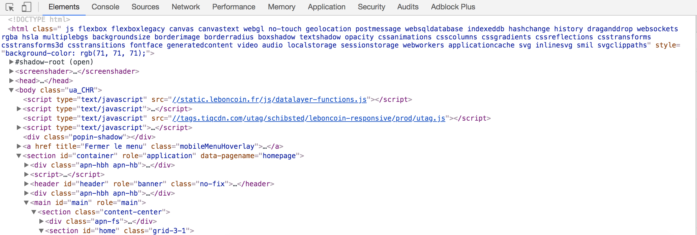

============
Introduction
============

Aujourd'hui l'or noir des entreprises est la donnée. Il existe une infinité de sources potentiellement récupérables 
et utilisables: 

- Données propriétaires (Données clients, Données d'exploitation, Données de capteurs...)
- Données Open Data (Adresses, Démographie des départements ou villes...)
- Données publiques disponibles sur le web (Tweets, Réseaux sociaux, ...)

Dans la quête de Data de chaque entreprise, l'important est d'agréger et de mettre en relation un grand nombre de données
différentes pour pouvoir en tirer le maximum d'informations et mettre en place des axes d'amélioration. 

Présentation du cours
---------------------

Le but de ce cours est de présenter les tenants et les aboutissants d'une infrastucture de récupération de données.

Contexte de Qwant
^^^^^^^^^^^^^^^^^
Qwant est un moteur de recherche européen basé sur un concept fort de vie privée. Nous ne gardons pas les informations
utilisateurs. 
Pour avoir quelques chiffres: 
- Nous avons actuellement un ferme de 750 crawlers qui permettent de récupérer environ 1500 pages secondes soit 5,4M de pages par heure.
- Le web francais est estimé à 150M de pages ce qui représente environ 2 Peta Bytes de données duppliquées.

Quelques mots clés et définitions
---------------------------------

Crawler
^^^^^^^
Un Crawler est un robot qui permet de récupérer des données non-structurées soit des informations textuelles, structurelles et de contenu d'un site web. 
La structure de l'algorithme utilisé doit être agnostique de la structure HTML du site web. Elle permet de récupérer des 
informations de base comme le texte, les images, les liens entrants ou sortants par exemple.

Scraper
^^^^^^^
Un Scraper est dépendant du site et de sa structure. Il permet de récupérer des informations beaucoup plus qualitatives
sur un site web. Les Scraper ne sont pas très facilement maintenables puisqu'ils sont basés sur la structure HTML qui est
vouée à changer plus ou moins rapidement selon les sites. 

Les bonnes pratiques
--------------------

On peut comprendre très rapidemement si les sites et les webmasters ont envie qu'on puisse accéder à leurs données. Plusieurs manières permettent de montrer ou d'expliciter les comportements non recommandés sur un site. 

Aujourd'hui certains sites utilisent des méthodes pour empecher la récupération massive de leurs données : 

- Génération à la volée de code HTML et CSS. Le nom des balises HTML est générée de facon à ce qu'on ne puisse pas se baser sur celles-ci. 
- Black list d'adresses IP détectées.
- Génération de contenu via du JavaScript
- Algorithmes de détection de comportements non-humains (vitesse de navigation, scroll, click,  etc)

Plusieurs méthodes sont possibles pour éviter ou contourner ces limitations mais elles ne seront pas abordées dans ce cours.

Robots.txt
^^^^^^^^^^
La limitation la plus simple et la plus connue est le fichier Robots.txt. Il est édité par les webmasters des sites 
pour "contrôler" le comportement des robots sur leur site. Différentes politiques sont mises en place par les organismes
en fonction des problématiques métiers. Ce fichier n'empêche absolument pas de récupérer les données mais fait part d'une 
bonne pratique.

- https://www.google.com/robots.txt
- http://www.seloger.com/robots.txt
- https://www.leboncoin.fr/robots.txt
- https://booking.com/robots.txt

Site Map ou Site Index
^^^^^^^^^^^^^^^^^^^^^^
Le site map ou le site index (plan du site) sont des pages HTML générées pour améliorer le SEO d'une page. Le SEO (Search Engine Optimisation) permet d'optimiser le référencement sur les moteurs de recherche. La plupart des gros sites ont des équipes SEO dédiées qui permettent aux sites d'être présents dans les premières positions lors des recherches associées. 
Ces pages donnent accès à l'arbre de génération ou de structure du site. La plupart du temps elles permettent l'exploration massive et facile des sites pour les robots de crawl des moteurs de recherche.

Surcharge du serveur
^^^^^^^^^^^^^^^^^^^^
La plupart des sites importants ont des infrastructures qui tiennent la charge et qui peuvent être utilisées et appelées
un très grand nombre de fois. D'autres sont beaucoup plus restreintes et donc il est important de ne pas surcharger celles-ci.
Les sites comme Wikipédia ou StackOverFlow empêchent les robots d'accéder trop rapidement à leurs infrastructures et forcent 
des temps d'arrêt entre la récupération des différentes pages.

Introduction au scraping
------------------------

Il existe deux grandes pratiques pour scraper un site efficacement. Nous allons aborder les deux :  

- Récupération et parsing du code HTML. Cette solution nécessite une compréhension du code et des notions basiques de DOM et architecture HTML.
- Récupération des appels API aux serveurs permettant de récupérer les informations directement à la source, la plupart du temps au format JSON. Cette deuxième solution est la plus efficace et facile mais les appels d'API sont souvent cachés ou bloqués. 

Dans les deux cas, nous utiliserons des requêtes HTTP et le package ``requests``. Celui-ci permet de faire des requêtes très rapidement et facilement via un interpreteur Python. De nombreux paramètres sont modifiables. 

Pour réaliser ces opérations une bonne pratique est d'utiliser l'outil de developpement de Chrome ou Firefox. Je conseille celui de Google qui est beaucoup plus intuitif et développé que celui de Mozilla. Il existe plusieurs raccourcis claviers mais le plus simple est de faire une click droit et ``inspecter``. 

Deux onglets sont importants dans notre cas : 
 
- ``Element`` : la partie correspondant au code HTML : elle permet de visualiser la structure et répérer les pointeurs des balises qui encapsulent nos données. 
- ``Network`` : cette partie permet d'analyser tous les appels réseaux réalisés depuis le front. C'est ici que les appels de 
récupération de données sont effectués. 

# Suite

Ouvrez un navigateur et allez à l'adresse http://localhost:8888

Allez directement voir le notebook `Part1_Simple_Web_Scraping.ipynb` quand vous avez terminé vous pouvez passer à la partie 2 `Part2_Web_Scraping_WebDriver.ipynb`
