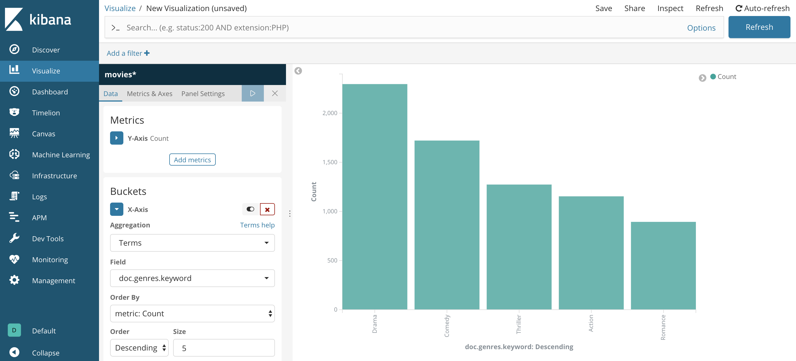

Introduction
============

Elasticsearch est un moteur de recherchetemps réel et Open Source. Ils
possèdent de nombreux avantages : - il met en place une API RESTful. -
il est distribué, ce qui lui permet d'être tolérant aux pannes. - il est
basé sur le moteur d'indexation d'Apache Lucène. - utilise le format
JSON pour le stockage - permet de faire de la recherche en texte libre.

Il est utilisé dans de nombreuses entreprises pour faire de la recherche
textuelle dans des documents ou alors traiter des tera de logs.

Dans ce cours nous allons aborder deux technologies, ElasticSearch et
Kibana.

Concepts
--------

-  ``Near Realtime (NRT)`` : La plupart des anciens moteurs de recherche
   devait processer et indexer les documents pour qu'ils puissent être
   recherchés. ElasticSearch permet de rechercher les nouveaux documents
   presque instantanément.

-  ``Document`` : Document est l'unité de base qui peut être indexé dans
   ElasticSearch. Un document est représenté au format JSON. On peut
   stocker autant de document que l'on souhaite dans un index.

-  ``Index`` : Un index est une collection de document qui ont des
   caractéristiques similaires. Un index est identifié par un nom. On
   peut créer autant d'index que l'on veut.

-  ``Node`` : Un Node (ou noeud en francais) est un serveur qui fait
   parti d'un cluster plus grand. Un noeud stocke les données et est
   optimisé pour retrouver les données.

-  ``Cluster`` : Un cluster est un ensemble de noeud qui communiquent
   entre eux. Un cluster peut contenir autant de noeuds que l'on veut.

-  ``Shards`` : Un index peut être tellement gros que la données des
   documents est plus importante que la capacité de stockage d'un node
   et donc d'un serveur. Pour pallier ce problème ElasticSearch met en
   place une méthode pour découper la données des index en des
   nombreuses petites parties qui sont appelés des shards. Chaque shards
   est stocké stocké sur un noeud différents.

   Cette technique est intéressante car elle permet de scaler
   horizontalement notre cluster (ie: augmenter le nombre de machines et
   donc de noeuds)

-  ``Replicas`` : Comme chaque noeud ne contient pas l'intégralité des
   données, on pourrait penser que si un noeud tombe en panne la donnée
   serait perdue. ElasticSearch met en place une technique de
   réplication qui permet de stocké ces différents Shards sur plusieurs
   noeuds. Cette technique est particulièrement intéressante puisqu'elle
   permet de palier à la panne des shards ou des noeuds.

Let's Play
==========

.. code:: ipython3

    from elasticsearch import Elasticsearch
    
    es_client = Elasticsearch(hosts=["elasticsearch"])

.. code:: ipython3

    es_client.ping()

.. parsed-literal::

    True

Pour indexer des documents, il suffit d'appeler la méthode ``index`` du
client.

.. code:: ipython3

    document = {
        "name":"Decision Trees", 
        "description":"A decision tree is a decision support tool that uses a tree-like graph or model of decisions and their possible consequences, including chance-event outcomes, resource costs, and utility. Take a look at the image to get a sense of how it looks like.",
        "algo_type":"Supervised Learning"
    }

.. code:: ipython3

    res = es_client.index(index="algorithms", doc_type='algo', id=1, body=document)
    print(res['result'])

.. parsed-literal::

    created

Le document à été créé avec succès, on peut maintenant le récupérer via
son index.

.. code:: ipython3

    import pprint

.. code:: ipython3

    res = es_client.get(index="algorithms", doc_type='algo', id=1)
    pprint.pprint(res["_source"])

.. parsed-literal::

    {'algo_type': 'Supervised Learning',
     'description': 'A decision tree is a decision support tool that uses a '
                    'tree-like graph or model of decisions and their possible '
                    'consequences, including chance-event outcomes, resource '
                    'costs, and utility. Take a look at the image to get a sense '
                    'of how it looks like.',
     'name': 'Decision Trees'}

.. code:: ipython3

    documents = [
        {
        "name":"Naive Bayes Classification", 
        "description":"Naive Bayes classifiers are a family of simple probabilistic classifiers based on applying Bayes’ theorem with strong (naive) independence assumptions between the features. The featured image is the equation — with P(A|B) is posterior probability, P(B|A) is likelihood, P(A) is class prior probability, and P(B) is predictor prior probability.",
        "algo_type":"Supervised Learning"
        },    {
        "name":"Logistic Regression", 
        "description":"Logistic regression is a powerful statistical way of modeling a binomial outcome with one or more explanatory variables. It measures the relationship between the categorical dependent variable and one or more independent variables by estimating probabilities using a logistic function, which is the cumulative logistic distribution.",
        "algo_type":"Supervised Learning"
    },    {
        "name":"Principal Component Analysis", 
        "description":"PCA is a statistical procedure that uses an orthogonal transformation to convert a set of observations of possibly correlated variables into a set of values of linearly uncorrelated variables called principal components.",
        "algo_type":"Unsupervised Learning"
    },    {
        "name":"Singular Value Decomposition", 
        "description":"In linear algebra, SVD is a factorization of a real complex matrix. For a given m * n matrix M, there exists a decomposition such that M = UΣV, where U and V are unitary matrices and Σ is a diagonal matrix.",
        "algo_type":"Unsupervised Learning"
    }
    ]

Si on ne précise pas l'ID lors de l'indexation, ElasticSearch se charge
d'en trouver un automatiquement

.. code:: ipython3

    for doc in documents:
        res = es_client.index(index="algorithms", doc_type='algo', id=None, body=doc)
        print(res["result"])

.. parsed-literal::

    {'_index': 'algorithms', '_type': 'algo', '_id': '5mNqJ2cBxwSTn_RqJ18g', '_version': 1, 'result': 'created', '_shards': {'total': 2, 'successful': 1, 'failed': 0}, '_seq_no': 0, '_primary_term': 1}
    {'_index': 'algorithms', '_type': 'algo', '_id': '52NqJ2cBxwSTn_RqJ187', '_version': 1, 'result': 'created', '_shards': {'total': 2, 'successful': 1, 'failed': 0}, '_seq_no': 0, '_primary_term': 1}
    {'_index': 'algorithms', '_type': 'algo', '_id': '6GNqJ2cBxwSTn_RqJ19M', '_version': 1, 'result': 'created', '_shards': {'total': 2, 'successful': 1, 'failed': 0}, '_seq_no': 1, '_primary_term': 1}
    {'_index': 'algorithms', '_type': 'algo', '_id': '6WNqJ2cBxwSTn_RqJ19X', '_version': 1, 'result': 'created', '_shards': {'total': 2, 'successful': 1, 'failed': 0}, '_seq_no': 0, '_primary_term': 1}

On récupère maintenant tous les éléments de l'index

.. code:: ipython3

    result = es_client.search(index="algorithms", body={"query": {"match_all": {}}})
    result

.. parsed-literal::

    {'took': 4,
     'timed_out': False,
     '_shards': {'total': 5, 'successful': 5, 'skipped': 0, 'failed': 0},
     'hits': {'total': 5,
      'max_score': 1.0,
      'hits': [{'_index': 'algorithms',
        '_type': 'algo',
        '_id': '5mNqJ2cBxwSTn_RqJ18g',
        '_score': 1.0,
        '_source': {'name': 'Naive Bayes Classification',
         'description': 'Naive Bayes classifiers are a family of simple probabilistic classifiers based on applying Bayes’ theorem with strong (naive) independence assumptions between the features. The featured image is the equation\u200a—\u200awith P(A|B) is posterior probability, P(B|A) is likelihood, P(A) is class prior probability, and P(B) is predictor prior probability.',
         'algo_type': 'Supervised Learning'}},
       {'_index': 'algorithms',
        '_type': 'algo',
        '_id': '52NqJ2cBxwSTn_RqJ187',
        '_score': 1.0,
        '_source': {'name': 'Logistic Regression',
         'description': 'Logistic regression is a powerful statistical way of modeling a binomial outcome with one or more explanatory variables. It measures the relationship between the categorical dependent variable and one or more independent variables by estimating probabilities using a logistic function, which is the cumulative logistic distribution.',
         'algo_type': 'Supervised Learning'}},
       {'_index': 'algorithms',
        '_type': 'algo',
        '_id': '6GNqJ2cBxwSTn_RqJ19M',
        '_score': 1.0,
        '_source': {'name': 'Principal Component Analysis',
         'description': 'PCA is a statistical procedure that uses an orthogonal transformation to convert a set of observations of possibly correlated variables into a set of values of linearly uncorrelated variables called principal components.',
         'algo_type': 'Unsupervised Learning'}},
       {'_index': 'algorithms',
        '_type': 'algo',
        '_id': '1',
        '_score': 1.0,
        '_source': {'name': 'Decision Trees',
         'description': 'A decision tree is a decision support tool that uses a tree-like graph or model of decisions and their possible consequences, including chance-event outcomes, resource costs, and utility. Take a look at the image to get a sense of how it looks like.',
         'algo_type': 'Supervised Learning'}},
       {'_index': 'algorithms',
        '_type': 'algo',
        '_id': '6WNqJ2cBxwSTn_RqJ19X',
        '_score': 1.0,
        '_source': {'name': 'Singular Value Decomposition',
         'description': 'In linear algebra, SVD is a factorization of a real complex matrix. For a given m * n matrix M, there exists a decomposition such that M = UΣV, where U and V are unitary matrices and Σ is a diagonal matrix.',
         'algo_type': 'Unsupervised Learning'}}]}}

La réponse nous donne des informations sur le temps d'exécution de la
requête le nombre de documents correspondant à la requête et l'ensemble
des documents.

.. code:: ipython3

    f"{result['hits']['total']} documents correspondent à la requêtes qui a pris {result['took']}ms"

.. parsed-literal::

    '5 documents correspondent à la requêtes qui a pris 4ms'

Affichons maintenant tous les documents :

.. code:: ipython3

    for hit in result['hits']['hits']:
        print("Name : {name}\n description : {description} \n Type : {algo_type}\n".format(**hit['_source']))
        print("******************")

.. parsed-literal::

    Name : Naive Bayes Classification
     description : Naive Bayes classifiers are a family of simple probabilistic classifiers based on applying Bayes’ theorem with strong (naive) independence assumptions between the features. The featured image is the equation — with P(A|B) is posterior probability, P(B|A) is likelihood, P(A) is class prior probability, and P(B) is predictor prior probability. 
     Type : Supervised Learning
    
    ******************
    Name : Logistic Regression
     description : Logistic regression is a powerful statistical way of modeling a binomial outcome with one or more explanatory variables. It measures the relationship between the categorical dependent variable and one or more independent variables by estimating probabilities using a logistic function, which is the cumulative logistic distribution. 
     Type : Supervised Learning
    
    ******************
    Name : Principal Component Analysis
     description : PCA is a statistical procedure that uses an orthogonal transformation to convert a set of observations of possibly correlated variables into a set of values of linearly uncorrelated variables called principal components. 
     Type : Unsupervised Learning
    
    ******************
    Name : Decision Trees
     description : A decision tree is a decision support tool that uses a tree-like graph or model of decisions and their possible consequences, including chance-event outcomes, resource costs, and utility. Take a look at the image to get a sense of how it looks like. 
     Type : Supervised Learning
    
    ******************
    Name : Singular Value Decomposition
     description : In linear algebra, SVD is a factorization of a real complex matrix. For a given m * n matrix M, there exists a decomposition such that M = UΣV, where U and V are unitary matrices and Σ is a diagonal matrix. 
     Type : Unsupervised Learning
    
    ******************

Pour supprimer un document il suffit d'appeler la méthode ``delete``.

.. code:: ipython3

    es_client.delete(index="algorithms", doc_type="algo", id="6WNqJ2cBxwSTn_RqJ19X")

.. parsed-literal::

    {'_index': 'algorithms',
     '_type': 'algo',
     '_id': '6WNqJ2cBxwSTn_RqJ19X',
     '_version': 2,
     'result': 'deleted',
     '_shards': {'total': 2, 'successful': 1, 'failed': 0},
     '_seq_no': 1,
     '_primary_term': 1}

.. code:: ipython3

    result = es_client.search(index="algorithms", body={"query": {"match_all": {}}})
    f"{result['hits']['total']} documents correspondent à la requêtes qui a pris {result['took']}ms"

.. parsed-literal::

    '4 documents correspondent à la requêtes qui a pris 5ms'

Faisons des choses un peu plus intéressantes maintenant.

Dans le répertoire ``data/`` il y a les données de 5000 films de la base
de TMDb.

Nettoyage
---------

Avant de commencer il faut nettoyer un peu les données du fichier csv.

.. code:: ipython3

    import pandas as pd
    import json
    df_movies = pd.read_csv("./data/tmdb_5000_movies.csv")

.. code:: ipython3

    def clean_words(l):
        return [elt["name"] for elt in json.loads(l)]

On transform les colones en listes propres

.. code:: ipython3

    for col in ["genres", "keywords", "production_countries", "spoken_languages"]:
        df_movies.loc[:,col] = df_movies.loc[:,col].apply(clean_words)

Pour indexer les documents il nous faut une liste de dictionnairess.
Pour cela on peut utiliser la méthode de pandas ``to_dict`` avec le
paramètre ``orient=records``.

.. code:: ipython3

    documents = df_movies.fillna("").to_dict(orient="records")

.. code:: ipython3

    documents[0:2]

.. parsed-literal::

    [{'budget': 237000000,
      'genres': ['Action', 'Adventure', 'Fantasy', 'Science Fiction'],
      'homepage': 'http://www.avatarmovie.com/',
      'id': 19995,
      'keywords': ['culture clash',
       'future',
       'space war',
       'space colony',
       'society',
       'space travel',
       'futuristic',
       'romance',
       'space',
       'alien',
       'tribe',
       'alien planet',
       'cgi',
       'marine',
       'soldier',
       'battle',
       'love affair',
       'anti war',
       'power relations',
       'mind and soul',
       '3d'],
      'original_language': 'en',
      'original_title': 'Avatar',
      'overview': 'In the 22nd century, a paraplegic Marine is dispatched to the moon Pandora on a unique mission, but becomes torn between following orders and protecting an alien civilization.',
      'popularity': 150.437577,
      'production_companies': '[{"name": "Ingenious Film Partners", "id": 289}, {"name": "Twentieth Century Fox Film Corporation", "id": 306}, {"name": "Dune Entertainment", "id": 444}, {"name": "Lightstorm Entertainment", "id": 574}]',
      'production_countries': ['United States of America', 'United Kingdom'],
      'release_date': '2009-12-10',
      'revenue': 2787965087,
      'runtime': 162.0,
      'spoken_languages': ['English', 'Español'],
      'status': 'Released',
      'tagline': 'Enter the World of Pandora.',
      'title': 'Avatar',
      'vote_average': 7.2,
      'vote_count': 11800},
     {'budget': 300000000,
      'genres': ['Adventure', 'Fantasy', 'Action'],
      'homepage': 'http://disney.go.com/disneypictures/pirates/',
      'id': 285,
      'keywords': ['ocean',
       'drug abuse',
       'exotic island',
       'east india trading company',
       "love of one's life",
       'traitor',
       'shipwreck',
       'strong woman',
       'ship',
       'alliance',
       'calypso',
       'afterlife',
       'fighter',
       'pirate',
       'swashbuckler',
       'aftercreditsstinger'],
      'original_language': 'en',
      'original_title': "Pirates of the Caribbean: At World's End",
      'overview': 'Captain Barbossa, long believed to be dead, has come back to life and is headed to the edge of the Earth with Will Turner and Elizabeth Swann. But nothing is quite as it seems.',
      'popularity': 139.082615,
      'production_companies': '[{"name": "Walt Disney Pictures", "id": 2}, {"name": "Jerry Bruckheimer Films", "id": 130}, {"name": "Second Mate Productions", "id": 19936}]',
      'production_countries': ['United States of America'],
      'release_date': '2007-05-19',
      'revenue': 961000000,
      'runtime': 169.0,
      'spoken_languages': ['English'],
      'status': 'Released',
      'tagline': 'At the end of the world, the adventure begins.',
      'title': "Pirates of the Caribbean: At World's End",
      'vote_average': 6.9,
      'vote_count': 4500}]

Pour éviter de faire plein de petits appels à ElasticSearch pour indexer
les 5000 films on peut utiliser un helper ``bulk`` pour indexer tous les
documents d'un seul coup.

.. code:: ipython3

    from elasticsearch.helpers import bulk

.. code:: ipython3

    import numpy as np

.. code:: ipython3

    def generate_data(documents):
        for docu in documents:
            yield {
                "_index": "movies",
                "_type": "movie",
                "_source": {k:v if v else None for k,v in docu.items()},
            }
    
    bulk(es_client, generate_data(documents))

.. parsed-literal::

    (4803, [])

On peut utiliser l'interface http pour vérifier que les index sont bien
à jours. L'index ``movies`` est présent on peut aussi voir le nombre de
documents et la taille en mémoire.

.. code:: ipython3

    !curl http://elasticsearch:9200/_cat/indices?v

.. parsed-literal::

    health status index      uuid                   pri rep docs.count docs.deleted store.size pri.store.size
    yellow open   movies     SejfLrNTSPKIlDC_uZKOrA   5   1       4803            0      8.4mb          8.4mb
    green  open   .kibana_1  dyttfDA0RQOth1uYklL3aw   1   0          4            0     19.5kb         19.5kb
    yellow open   algorithms THPXp_XXSJaxmveVWl_e4Q   5   1          4            0     19.3kb         19.3kb

On peut voir aussi quelques documents avec le endpoint HTTP suivant

.. code:: ipython3

    !curl http://elasticsearch:9200/movies/_search

.. parsed-literal::

    {"took":8,"timed_out":false,"_shards":{"total":5,"successful":5,"skipped":0,"failed":0},"hits":{"total":4803,"max_score":1.0,"hits":[{"_index":"movies","_type":"movie","_id":"jGObJ2cBxwSTn_Rqynj9","_score":1.0,"_source":{"doc":{"budget":250000000,"genres":["Action","Crime","Drama","Thriller"],"homepage":"http://www.thedarkknightrises.com/","id":49026,"keywords":["dc comics","crime fighter","terrorist","secret identity","burglar","hostage drama","time bomb","gotham city","vigilante","cover-up","superhero","villainess","tragic hero","terrorism","destruction","catwoman","cat burglar","imax","flood","criminal underworld","batman"],"original_language":"en","original_title":"The Dark Knight Rises","overview":"Following the death of District Attorney Harvey Dent, Batman assumes responsibility for Dent's crimes to protect the late attorney's reputation and is subsequently hunted by the Gotham City Police Department. Eight years later, Batman encounters the mysterious Selina Kyle and the villainous Bane, a new terrorist leader who overwhelms Gotham's finest. The Dark Knight resurfaces to protect a city that has branded him an enemy.","popularity":112.31295,"production_companies":"[{\"name\": \"Legendary Pictures\", \"id\": 923}, {\"name\": \"Warner Bros.\", \"id\": 6194}, {\"name\": \"DC Entertainment\", \"id\": 9993}, {\"name\": \"Syncopy\", \"id\": 9996}]","production_countries":["United States of America"],"release_date":"2012-07-16","revenue":1084939099,"runtime":165.0,"spoken_languages":["English"],"status":"Released","tagline":"The Legend Ends","title":"The Dark Knight Rises","vote_average":7.6,"vote_count":9106}}},{"_index":"movies","_type":"movie","_id":"jWObJ2cBxwSTn_Rqynj9","_score":1.0,"_source":{"doc":{"budget":260000000,"genres":["Action","Adventure","Science Fiction"],"homepage":"http://movies.disney.com/john-carter","id":49529,"keywords":["based on novel","mars","medallion","space travel","princess","alien","steampunk","martian","escape","edgar rice burroughs","alien race","superhuman strength","mars civilization","sword and planet","19th century","3d"],"original_language":"en","original_title":"John Carter","overview":"John Carter is a war-weary, former military captain who's inexplicably transported to the mysterious and exotic planet of Barsoom (Mars) and reluctantly becomes embroiled in an epic conflict. It's a world on the brink of collapse, and Carter rediscovers his humanity when he realizes the survival of Barsoom and its people rests in his hands.","popularity":43.926995,"production_companies":"[{\"name\": \"Walt Disney Pictures\", \"id\": 2}]","production_countries":["United States of America"],"release_date":"2012-03-07","revenue":284139100,"runtime":132.0,"spoken_languages":["English"],"status":"Released","tagline":"Lost in our world, found in another.","title":"John Carter","vote_average":6.1,"vote_count":2124}}},{"_index":"movies","_type":"movie","_id":"kWObJ2cBxwSTn_Rqynj9","_score":1.0,"_source":{"doc":{"budget":250000000,"genres":["Adventure","Fantasy","Family"],"homepage":"http://harrypotter.warnerbros.com/harrypotterandthehalf-bloodprince/dvd/index.html","id":767,"keywords":["witch","magic","broom","school of witchcraft","wizardry","apparition","teenage crush","werewolf"],"original_language":"en","original_title":"Harry Potter and the Half-Blood Prince","overview":"As Harry begins his sixth year at Hogwarts, he discovers an old book marked as 'Property of the Half-Blood Prince', and begins to learn more about Lord Voldemort's dark past.","popularity":98.885637,"production_companies":"[{\"name\": \"Warner Bros.\", \"id\": 6194}, {\"name\": \"Heyday Films\", \"id\": 7364}]","production_countries":["United Kingdom","United States of America"],"release_date":"2009-07-07","revenue":933959197,"runtime":153.0,"spoken_languages":["English"],"status":"Released","tagline":"Dark Secrets Revealed","title":"Harry Potter and the Half-Blood Prince","vote_average":7.4,"vote_count":5293}}},{"_index":"movies","_type":"movie","_id":"lGObJ2cBxwSTn_Rqynj9","_score":1.0,"_source":{"doc":{"budget":200000000,"genres":["Adventure","Action","Thriller","Crime"],"homepage":"http://www.mgm.com/view/movie/234/Quantum-of-Solace/","id":10764,"keywords":["killing","undercover","secret agent","british secret service"],"original_language":"en","original_title":"Quantum of Solace","overview":"Quantum of Solace continues the adventures of James Bond after Casino Royale. Betrayed by Vesper, the woman he loved, 007 fights the urge to make his latest mission personal. Pursuing his determination to uncover the truth, Bond and M interrogate Mr. White, who reveals that the organization that blackmailed Vesper is far more complex and dangerous than anyone had imagined.","popularity":107.92881100000001,"production_companies":"[{\"name\": \"Eon Productions\", \"id\": 7576}]","production_countries":["United Kingdom","United States of America"],"release_date":"2008-10-30","revenue":586090727,"runtime":106.0,"spoken_languages":["English","Español","Italiano","Français","Deutsch"],"status":"Released","tagline":"For love, for hate, for justice, for revenge.","title":"Quantum of Solace","vote_average":6.1,"vote_count":2965}}},{"_index":"movies","_type":"movie","_id":"lWObJ2cBxwSTn_Rqynj9","_score":1.0,"_source":{"doc":{"budget":200000000,"genres":["Adventure","Fantasy","Action"],"homepage":"http://disney.go.com/disneypictures/pirates/","id":58,"keywords":["witch","fortune teller","bondage","exotic island","monster","captain","card game","east india trading company","compass","ship","daughter","pirate","swashbuckler","aftercreditsstinger"],"original_language":"en","original_title":"Pirates of the Caribbean: Dead Man's Chest","overview":"Captain Jack Sparrow works his way out of a blood debt with the ghostly Davey Jones, he also attempts to avoid eternal damnation.","popularity":145.84737900000002,"production_companies":"[{\"name\": \"Walt Disney Pictures\", \"id\": 2}, {\"name\": \"Jerry Bruckheimer Films\", \"id\": 130}, {\"name\": \"Second Mate Productions\", \"id\": 19936}]","production_countries":["Jamaica","United States of America","Bahamas","Dominica"],"release_date":"2006-06-20","revenue":1065659812,"runtime":151.0,"spoken_languages":["English","Türkçe","ελληνικά","普通话"],"status":"Released","tagline":"Jack is back!","title":"Pirates of the Caribbean: Dead Man's Chest","vote_average":7.0,"vote_count":5246}}},{"_index":"movies","_type":"movie","_id":"pWObJ2cBxwSTn_Rqynj9","_score":1.0,"_source":{"doc":{"budget":150000000,"genres":["Action","Adventure","Science Fiction","Thriller"],"homepage":"http://www.jurassicworld.com/","id":135397,"keywords":["monster","dna","tyrannosaurus rex","velociraptor","island","sequel","suspense","disaster","escape","dinosaur","amusement park","animal attack","theme park","jurassic park","3d","animal horror"],"original_language":"en","original_title":"Jurassic World","overview":"Twenty-two years after the events of Jurassic Park, Isla Nublar now features a fully functioning dinosaur theme park, Jurassic World, as originally envisioned by John Hammond.","popularity":418.708552,"production_companies":"[{\"name\": \"Universal Studios\", \"id\": 13}, {\"name\": \"Amblin Entertainment\", \"id\": 56}, {\"name\": \"Legendary Pictures\", \"id\": 923}, {\"name\": \"Fuji Television Network\", \"id\": 3341}, {\"name\": \"Dentsu\", \"id\": 6452}]","production_countries":["United States of America"],"release_date":"2015-06-09","revenue":1513528810,"runtime":124.0,"spoken_languages":["English"],"status":"Released","tagline":"The park is open.","title":"Jurassic World","vote_average":6.5,"vote_count":8662}}},{"_index":"movies","_type":"movie","_id":"q2ObJ2cBxwSTn_Rqynj9","_score":1.0,"_source":{"doc":{"budget":200000000,"genres":["Animation","Family"],"homepage":null,"id":62211,"keywords":["monster","dormitory","games","animation","best friend","university","scary","aftercreditsstinger"],"original_language":"en","original_title":"Monsters University","overview":"A look at the relationship between Mike and Sulley during their days at Monsters University — when they weren't necessarily the best of friends.","popularity":89.186492,"production_companies":"[{\"name\": \"Walt Disney Pictures\", \"id\": 2}, {\"name\": \"Pixar Animation Studios\", \"id\": 3}]","production_countries":["United States of America"],"release_date":"2013-06-20","revenue":743559607,"runtime":104.0,"spoken_languages":["English"],"status":"Released","tagline":"School never looked this scary.","title":"Monsters University","vote_average":7.0,"vote_count":3528}}},{"_index":"movies","_type":"movie","_id":"u2ObJ2cBxwSTn_Rqynj-","_score":1.0,"_source":{"doc":{"budget":150000000,"genres":["Adventure","Fantasy","Action","Romance"],"homepage":"http://disney.go.com/disneypictures/princeofpersia","id":9543,"keywords":["persia","sandstorm","brother against brother","armageddon","regent","based on video game"],"original_language":"en","original_title":"Prince of Persia: The Sands of Time","overview":"A rogue prince reluctantly joins forces with a mysterious princess and together, they race against dark forces to safeguard an ancient dagger capable of releasing the Sands of Time – gift from the gods that can reverse time and allow its possessor to rule the world.","popularity":62.169881000000004,"production_companies":"[{\"name\": \"Walt Disney Pictures\", \"id\": 2}, {\"name\": \"Jerry Bruckheimer Films\", \"id\": 130}]","production_countries":["United States of America"],"release_date":"2010-05-19","revenue":335154643,"runtime":116.0,"spoken_languages":["English"],"status":"Released","tagline":"Defy the Future","title":"Prince of Persia: The Sands of Time","vote_average":6.2,"vote_count":2317}}},{"_index":"movies","_type":"movie","_id":"wmObJ2cBxwSTn_Rqynj-","_score":1.0,"_source":{"doc":{"budget":180000000,"genres":["Animation","Family"],"homepage":"http://disney.go.com/disneypictures/wall-e/","id":10681,"keywords":["romantic comedy"],"original_language":"en","original_title":"WALL·E","overview":"WALL·E is the last robot left on an Earth that has been overrun with garbage and all humans have fled to outer space. For 700 years he has continued to try and clean up the mess, but has developed some rather interesting human-like qualities. When a ship arrives with a sleek new type of robot, WALL·E thinks he's finally found a friend and stows away on the ship when it leaves.","popularity":66.390712,"production_companies":"[{\"name\": \"Walt Disney Pictures\", \"id\": 2}, {\"name\": \"Pixar Animation Studios\", \"id\": 3}, {\"name\": \"FortyFour Studios\", \"id\": 93408}]","production_countries":["United States of America"],"release_date":"2008-06-22","revenue":521311860,"runtime":98.0,"spoken_languages":["English"],"status":"Released","tagline":"An adventure beyond the ordinar-E.","title":"WALL·E","vote_average":7.8,"vote_count":6296}}},{"_index":"movies","_type":"movie","_id":"xGObJ2cBxwSTn_Rqynj-","_score":1.0,"_source":{"doc":{"budget":200000000,"genres":["Action","Adventure","Science Fiction"],"homepage":"http://www.sonypictures.com/movies/2012","id":14161,"keywords":["civilization","natural disaster","end of the world","disaster","apocalypse","destruction","volcanic eruption","mayan","ark","solar","destruction  of mankind"],"original_language":"en","original_title":"2012","overview":"Dr. Adrian Helmsley, part of a worldwide geophysical team investigating the effect on the earth of radiation from unprecedented solar storms, learns that the earth's core is heating up. He warns U.S. President Thomas Wilson that the crust of the earth is becoming unstable and that without proper preparations for saving a fraction of the world's population, the entire race is doomed. Meanwhile, writer Jackson Curtis stumbles on the same information. While the world's leaders race to build \"arks\" to escape the impending cataclysm, Curtis struggles to find a way to save his family. Meanwhile, volcanic eruptions and earthquakes of unprecedented strength wreak havoc around the world.","popularity":45.274225,"production_companies":"[{\"name\": \"Columbia Pictures\", \"id\": 5}, {\"name\": \"Centropolis Entertainment\", \"id\": 347}, {\"name\": \"The Mark Gordon Company\", \"id\": 1557}, {\"name\": \"Farewell Productions\", \"id\": 10905}]","production_countries":["Canada","United States of America"],"release_date":"2009-10-10","revenue":769653595,"runtime":158.0,"spoken_languages":["English","Français","हिन्दी","Italiano","Latin","普通话","Português","Pусский",""],"status":"Released","tagline":"We Were Warned.","title":"2012","vote_average":5.6,"vote_count":4903}}}]}}

Kibana
======

.. code:: ipython3

    from IPython.display import Image

C'est le moment de commencer à utiliser Kibana. Kibana est un soft de la
suite ELK (ElasticSearch, Kibana, Logstash) qui permet de gérer de façon
graphique les données dans les index ElasticSearch.

Index Pattern
-------------

Dans l'onglet ``Management``, il faut spécifier à Kibana d'aller
chercher un index spécifique sur ElasticSearch. Aller dans
``Create index pattern`` et taper les premières lettres du nom de
l'index que vous voulez parcourir. Ici ``movies``, vous verrez alors la
page suivante, référençant l'intégralité des champs de l'index.

.. code:: ipython3

    Image("./img/index_pattern.png")

.. image:: output_48_0.png

Vous pouvez ensuite aller dans l'onglet ``Discover`` pour voir un
apperçu des documents que vous venez d'indexer. Vous pouvez aussi, sur
la droite, appliquer des filtres pour faire des requêtes simples sur vos
données. Ici on appliquera un filtre sur le genre ``Comedy``.

.. code:: ipython3

    Image("./img/discover.png")

.. image:: output_50_0.png

Vous pouvez aller ensuite dans l'onglet ``Visualize`` pour commencer à
jouer avec les graphiques. Par exemple on peut créer un histograme des
budgets des différents films.

.. code:: ipython3

    Image("./img/budget.png")

.. image:: output_52_0.png

Ou encore des genres des différents films

.. code:: ipython3

    Image("./img/gender.png")

Retournons maintenant un peu dans notre code pour commencer à utiliser
ses données. Il va maintenant falloir se plonger dans les requêtes
ElasticSearch. Ce n'est pas la choise la plus aisée, elles deviennent
vite illisibles et complexes.

.. code:: ipython3

    QUERY = {
        "query": {
            "match_all": {}
        }
    }

Cette requête simple permet de récupérer l'intégralité des documents
d'un index.

.. code:: ipython3

    QUERY = {
      "query": {
        "term" : { 
            "title" : "superman"} 
      }
    }

Cette seconde requête permet de récupérer tous les documents dont le
titre contient ``SuperMan``.

.. code:: ipython3

    result = es_client.search(index="movies", body=QUERY)
    [elt['_source']['title'] for elt in result["hits"]["hits"]]

.. parsed-literal::

    ['Superman',
     'Superman Returns',
     'Superman II',
     'Superman III',
     'Batman v Superman: Dawn of Justice',
     'Superman IV: The Quest for Peace']

On veut maintenant chercher tous les films contenant ``SuperMan`` mais
qui ne contiennent pas ``Batman``. Pour cela on est forcé d'utilisé une
requête composée appelée ``bool query`` elle permet de transformer
chaque requête en un filtre booléen.

.. code:: ipython3

    QUERY = {
      "query": {
        "bool" : {
          "must" : {
            "term" : { "title" : "superman" }
          },
          "must_not" : {
                      "term" : { "title" : "batman" }
          }
      }
    }
    }

.. code:: ipython3

    result = es_client.search(index="movies", body=QUERY)
    [elt['_source']['title'] for elt in result["hits"]["hits"]]

.. parsed-literal::

    ['Superman',
     'Superman Returns',
     'Superman II',
     'Superman III',
     'Superman IV: The Quest for Peace']

On peut encore réduire les resultats en filtrant sur le budget du film.
On veut en plus des films de SuperMan sans Batman récupérer les films
qui on eu un budget de plus de ou égal à 20M et moins de 55M.

.. code:: ipython3

    QUERY = {
      "query": {
        "bool" : {
          "must" : [
              {
            "term" : { "title" : "superman" }},
            {"range" : {
              "budget" : { "gte" : 20000000, "lt" : 55000000 }
            }}
          ],
          "must_not" : {
                      "term" : { "title" : "batman" }
          }
      }
    }
    }

.. code:: ipython3

    result = es_client.search(index="movies", body=QUERY)
    {elt['_source']['title']:elt['_source']['budget']  for elt in result["hits"]["hits"]}

.. parsed-literal::

    {'Superman II': 54000000, 'Superman III': 39000000}

Si on veut faire une recherche dans plusieurs champs de chaque document
de l'index on peut faire une requête de ``multi_match``

.. code:: ipython3

    QUERY = {
      "query": {
        "multi_match" : {
          "query":    "Smith",
          "fields": [ "title", "overview" ] 
        }
      }
    }

.. code:: ipython3

    result = es_client.search(index="movies", body=QUERY)
    [elt['_source']['title']  for elt in result["hits"]["hits"]]

.. parsed-literal::

    ['Infamous',
     'Mr. Smith Goes to Washington',
     'The New World',
     'The Matrix Revolutions',
     'Roger & Me',
     'Mr. & Mrs. Smith',
     'Growing Up Smith',
     'Two Can Play That Game',
     'Pocahontas',
     'The Dead Zone']

On peut vouloir trier les résultats selon la popularité par exemple.

.. code:: ipython3

    QUERY = {
      "query": {
        "multi_match" : {
          "query":    "Smith",
          "fields": [ "title", "overview" ] 
        }
      },
        "sort" : [
            { "popularity" : {"order" : "desc"}}
        ]
    }

.. code:: ipython3

    result = es_client.search(index="movies", body=QUERY)
    {elt['_source']['title']:elt['_source']['popularity']  for elt in result["hits"]["hits"]}

.. parsed-literal::

    {'The Matrix Revolutions': 73.313918,
     'The Matrix Reloaded': 70.78591,
     'Men in Black 3': 52.035179,
     'Pocahontas': 47.845589000000004,
     'Mr. & Mrs. Smith': 44.635452,
     'I Am Number Four': 43.450266,
     '8 Mile': 32.798571,
     'The New World': 19.106154,
     'The Dead Zone': 16.785120000000003,
     'Mr. Smith Goes to Washington': 12.2624}

ElasticSearch gère aussi bien les dates. On peut vouloir trier par date
de sortie.

.. code:: ipython3

    QUERY = {
      "query": {
        "multi_match" : {
          "query":    "Smith",
          "fields": [ "title", "overview" ] 
        }
      },
        "sort" : [
            { "release_date" : {"order" : "desc"}}
        ]
    }

.. code:: ipython3

    result = es_client.search(index="movies", body=QUERY)
    {elt['_source']['title']:elt['_source']['release_date']  for elt in result["hits"]["hits"]}

.. parsed-literal::

    {'Growing Up Smith': '2017-02-03',
     'Captive': '2015-09-17',
     'Men in Black 3': '2012-05-23',
     'I Am Number Four': '2011-02-18',
     'Justin Bieber: Never Say Never': '2011-02-11',
     'Yogi Bear': '2010-12-11',
     'Gunless': '2010-04-30',
     'Emma': '2009-10-11',
     'Infamous': '2006-11-16',
     'The New World': '2005-12-25'}

Aggregations
------------

Les aggregations sont des requêtes complexes mais qui permettent de
faire des opérations très rapides sur les données. La syntaxe devient
très vite complexe. Par exemple, pour récupérer le nombre de film par
genre.

.. code:: ipython3

    QUERY = {
        "aggs": {
        "count_gender": {
          "terms": {
            "field": "genres.keyword",
            "size": 5,
            "order": {
              "_count": "desc"
            }
          }
            }
      }
    }

.. code:: ipython3

    result = es_client.search(index="movies", body=QUERY)
    result["aggregations"]["count_gender"]["buckets"]

.. parsed-literal::

    [{'key': 'Drama', 'doc_count': 2297},
     {'key': 'Comedy', 'doc_count': 1722},
     {'key': 'Thriller', 'doc_count': 1274},
     {'key': 'Action', 'doc_count': 1154},
     {'key': 'Romance', 'doc_count': 894}]

Le paramètre size permet de récupérer les N premières aggrégations.

Ensuite si on veut aller plus loin on peut vouloir récupérer la moyenne
des budgets par genre. Il faut intégrer un nouveau niveau d'aggregation.
Pour cela on utilise la syntaxe suivante.

.. code:: ipython3

    QUERY = {
        "aggs": {
            "count_gender": {
                "terms": {
                    "field": "genres.keyword",
                    "size": 3,
                    "order": {
                        "average_budget": "desc"
                    }
                },
                "aggs": {
                    "average_budget":{
                        "avg" : {
                            "field" : "budget"
                        }
                    }
                }
            }
        }
    }

.. code:: ipython3

    result = es_client.search(index="movies", body=QUERY)
    result["aggregations"]["count_gender"]["buckets"]

.. parsed-literal::

    [{'key': 'Animation',
      'doc_count': 234,
      'average_budget': {'value': 74774139.6923077}},
     {'key': 'Adventure',
      'doc_count': 790,
      'average_budget': {'value': 72876523.59248957}},
     {'key': 'Fantasy',
      'doc_count': 424,
      'average_budget': {'value': 71107378.87862797}}]

Exercice
========

.. code:: ipython3

    import pandas as pd 

.. code:: ipython3

    df_credits = pd.read_csv("data/tmdb_5000_credits.csv")

.. code:: ipython3

    df_credits.head()

.. raw:: html

    

    
    <table border="1" class="dataframe">
      <thead>
        <tr style="text-align: right;">
          <th></th>
          <th>movie_id</th>
          <th>title</th>
          <th>cast</th>
          <th>crew</th>
        </tr>
      </thead>
      <tbody>
        <tr>
          <th>0</th>
          <td>19995</td>
          <td>Avatar</td>
          <td>[{"cast_id": 242, "character": "Jake Sully", "...</td>
          <td>[{"credit_id": "52fe48009251416c750aca23", "de...</td>
        </tr>
        <tr>
          <th>1</th>
          <td>285</td>
          <td>Pirates of the Caribbean: At World's End</td>
          <td>[{"cast_id": 4, "character": "Captain Jack Spa...</td>
          <td>[{"credit_id": "52fe4232c3a36847f800b579", "de...</td>
        </tr>
        <tr>
          <th>2</th>
          <td>206647</td>
          <td>Spectre</td>
          <td>[{"cast_id": 1, "character": "James Bond", "cr...</td>
          <td>[{"credit_id": "54805967c3a36829b5002c41", "de...</td>
        </tr>
        <tr>
          <th>3</th>
          <td>49026</td>
          <td>The Dark Knight Rises</td>
          <td>[{"cast_id": 2, "character": "Bruce Wayne / Ba...</td>
          <td>[{"credit_id": "52fe4781c3a36847f81398c3", "de...</td>
        </tr>
        <tr>
          <th>4</th>
          <td>49529</td>
          <td>John Carter</td>
          <td>[{"cast_id": 5, "character": "John Carter", "c...</td>
          <td>[{"credit_id": "52fe479ac3a36847f813eaa3", "de...</td>
        </tr>
      </tbody>
    </table>
    

1) Nettoyer les données de la DataFrame d'acteurs comme précédement.
2) Merger les deux DataFrame en utilisant l'identifiant du film.
3) Créer un nouvel Index ``augmented_movies`` similaire à l'index
   précédant mais en ajoutant les données des acteurs.
4) Créer une fonction permettant de trouver tous les films d'un acteur.
5) Trouver quel acteur à jouer dans les films avec les plus gros
   budgets.
6) Réaliser, sur Kibana, 3 graphiques de votre choix
